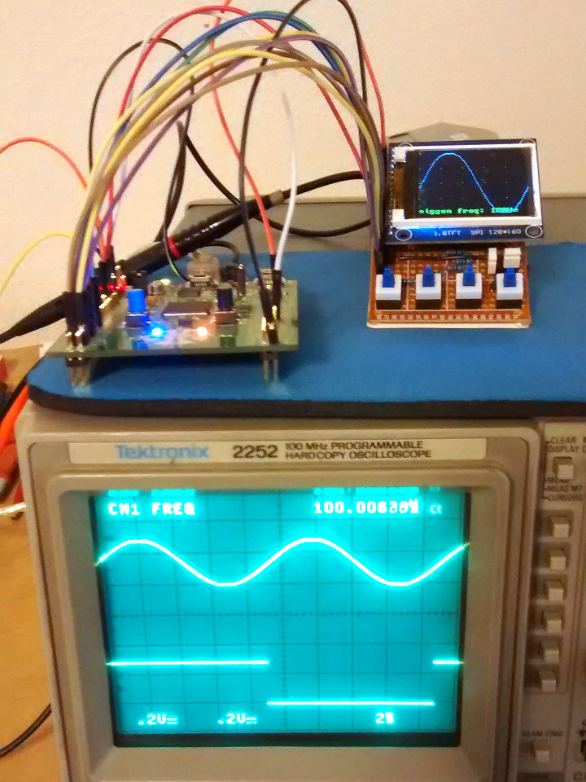

++++++++++++++++++++
STM32F3 Oscilloscope
++++++++++++++++++++

|license|

.. |license| image:: https://img.shields.io/badge/License-MIT-yellow.svg
   :target: https://en.wikipedia.org/wiki/MIT_License
   :alt: MIT Licensed

Oscilloscopes are the absolute coolest tool ever! Nothing is better at letting
us see, in real time, the "magic" working inside electronics.

So, naturally, I want to build one. This is a project using an STM32F303
Discovery development board, programmed in Rust, to make a low-bandwidth
digital storage oscilloscope (DSO).

Why? It's been done hundreds of times before, and the end result is not
terribly useful (at least not compared to my beloved Tek 2252).

Because: I'll learn more about developing for embedded in Rust, and about
analog electronics and doing analog-to-digital conversions well, and it'll be
fun!

Here's what the current prototype looks like:

.. |pic1| image:: docs/20170719-prototype.jpg
   :width: 98%
   :alt: prototype
   :target: docs/20170719-prototype.jpg

+--------+--------+
| |pic1| | |pic2| |
+--------+--------+

The hardware used:

* STM32F3 Discovery development board,
* ST7735 1.8" 128x160 color LCD (`Vetco part number VUPN6482
  <https://vetco.net/products/128x160-color-lcd-module-with-sd-slot>`_,
  "128x160 Color LCD Module with SD Slot"),
* Four momentary-on pushbuttons,
* Various other discrete components for the input stage and support circuits.

Current Status
==============
At this early stage in the project, these features are working:

* Single channel sample capture, at up to 1,600,000 samples per second.
* Display of the sampled data on the LCD, limited to about 100 sweeps per
  second due to the bandwidth of the LCD controller.
* Selection of timebase via pushbutton 1, in standard (1x, 2x, 5x per decade)
  steps from 20µs/div out to 1s/div, plus a strip-chart like 32s/div mode.
* Signal generation outputs, one a rough sine wave, the other a ramp.
* Selection of the signal generator output frequency via pushbutton 4, from 1Hz
  to 10kHz, in half-decade steps.

Roadmap
=======
Planned improvements include:

* Rust-ify the code: much of it is currently written using C idioms.
* Optimize sampling time per sample, based on sampling rate.
* Evaluate the usefulness of higher-sample-rate, lower-accuracy configurations
  (the theoretical limit is 9Msps at 6 bits with increased timing jitter).
* Add a trigger mechanism, probably using an on-board comparator, and one channel
  of the DAC for the trigger reference voltage.
* Add adjustable vertical gain, perhaps using the on-board op-amp as a programmable
  gain amplifier.
* Add dual-channel capability, or possibly even quad-channel and/or a logic
  analyzer mode.
* Finish designing and prototyping the analog input stage.
* Use a rotary control to make the user interface easier to use.

Documentation
=============

* `Connections <docs/connections.html>`_
* `Peripheral Usage <docs/peripherals.html>`_

License
=======

All code original to this project is licensed under the `MIT/Expat
License <https://en.wikipedia.org/wiki/MIT_License>`_:

  Copyright © 2017 Sean Bolton.

  Permission is hereby granted, free of charge, to any person obtaining
  a copy of this software and associated documentation files (the
  "Software"), to deal in the Software without restriction, including
  without limitation the rights to use, copy, modify, merge, publish,
  distribute, sublicense, and/or sell copies of the Software, and to
  permit persons to whom the Software is furnished to do so, subject to
  the following conditions:

  The above copyright notice and this permission notice shall be
  included in all copies or substantial portions of the Software.

  THE SOFTWARE IS PROVIDED "AS IS", WITHOUT WARRANTY OF ANY KIND,
  EXPRESS OR IMPLIED, INCLUDING BUT NOT LIMITED TO THE WARRANTIES OF
  MERCHANTABILITY, FITNESS FOR A PARTICULAR PURPOSE AND
  NONINFRINGEMENT. IN NO EVENT SHALL THE AUTHORS OR COPYRIGHT HOLDERS BE
  LIABLE FOR ANY CLAIM, DAMAGES OR OTHER LIABILITY, WHETHER IN AN ACTION
  OF CONTRACT, TORT OR OTHERWISE, ARISING FROM, OUT OF OR IN CONNECTION
  WITH THE SOFTWARE OR THE USE OR OTHER DEALINGS IN THE SOFTWARE.

Any code included from other sources is also licensed under the MIT license,
as indicated in each respective file. These include:

* build.rs - Copyright © 2017 Jorge Aparicio
* src/parallax_8x12_font.rs - Copyright © 2006 Parallax, Inc.
* src/old_c/ST7735.{c,h} - Written by Limor Fried/Ladyada for Adafruit Industries.
