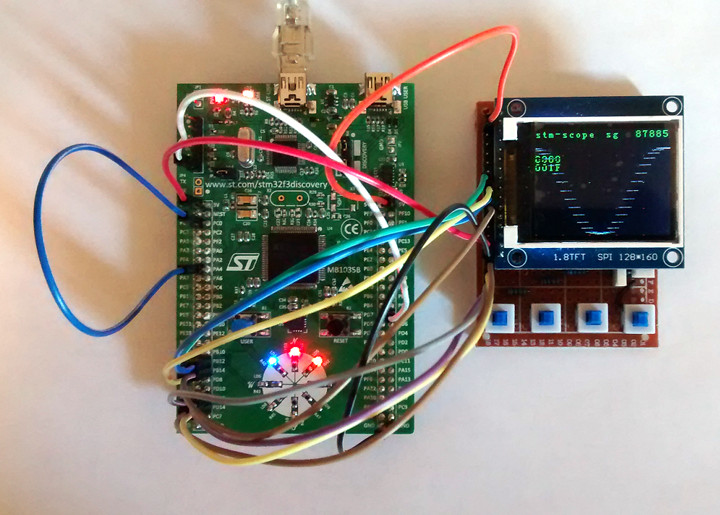

++++++++++++++++++++
STM32F3 Oscilloscope
++++++++++++++++++++

OMG, oscilloscopes are the bomb! No tool is better at letting us see, in real
time, the "magic" working inside electronics.

So, naturally, I want to build them. This is a project using an STM32F303
Discovery development board, programmed in Rust, to make a low-bandwidth
digital storage oscilloscope (DSO).

Why? It's been done hundreds of times before, and the end result is not
terribly useful (at least not compared to my beloved Tek 2252).

Because: I'll learn a lot about developing for embedded in Rust, and about
analog electronics and doing analog-to-digital conversions well, and it'll be
fun!

Here's what the current prototype looks like:

The hardware used:

* STM32F3 Discovery development board,
* ST7735 1.8" 128x160 color LCD,
* Four momentary-on pushbuttons,
* Various other discrete components for the input stage and support circuits.

