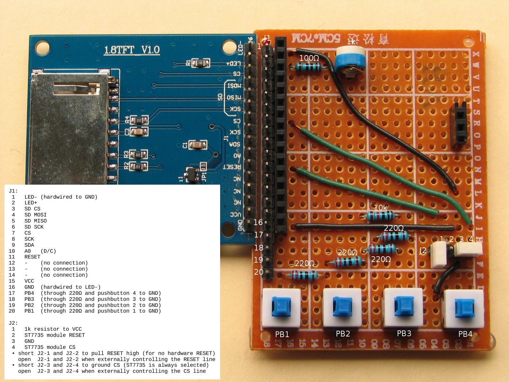

++++++++++++++++++++++++++++++++++
STM32F3 Oscilloscope - Connections
++++++++++++++++++++++++++++++++++

Oscilloscope Inputs
-------------------
* PC1 - input, range GND to about 3.2V. This pin is not even one of the 5V tolerant
  ones, so be *very* careful with your input!

Signal Generator Outputs
------------------------
* PA4 - "sine" wave output, about 3.2Vpp
* PA5 - "ramp" (escalator) output, about 3.2Vpp

Note that on the STM32F3 Discovery board, PA5 is connected to the L3GD20
gyroscope. This shouldn't be a problem while the L3GD20 is not being used, but
do be careful!

ITM (Instruction Trace Macrocell) Debugging
-------------------------------------------
On the STM32F3 Discovery, solder bridge SB10 will connect the STM32F303Bx PB3
pin (SWO output) to the SWO input of the on-board ST-Link programmer. According to the
STM32F3 Discovery User Manual (UM1570, DM00063382), SB10 should come from the
factory soldered, but on my board it is not. In order to use ITM debugging
features (n.b. the Rust cortex-m-rt crate ``iprintln!`` macro), I have to
place a jumper from PB3 to CN3 pin 6 (SWO input).

ST7735 LCD Display and Pushbutton Breakout Board
------------------------------------------------
This project uses a custom breakout board to make using the display and
pushbuttons easier. This photo of the board details the connections between its
header J1, and the ST7735 LCD and pushbuttons. Note that the order of pins on
the LCD is reversed from the order of pins on J1: LCD pin 1 is J1 pin 16, while
LCD pin 16 is J1 pin 1.

Connections between the breakout board and the STM32F3 Discovery are as follows:

=========   ==   ======   =======   =================   =====
STM32F3          ST7735   Wire[A]
Discovery   J1   Module   Color     Function            Notes
=========   ==   ======   =======   =================   =====
–            1     16               LED backlight GND   [B]
–            2     15     orange    LED backlight +     [C]
–            3     14               (SD CS)
–            4     13               (SD MOSI)
–            5     12               (SD MISO)
–            6     11               (SD SCK)
PB10         7     10     (note)    CS                  [D]
PB13         8      9     green     SCK / SCL
PB15         9      8     yellow    SDA / MOSI
PB12        10      7     blue      A0 / D/C
PB14        11      6     brown     RESET
–           12      5               (no connection)
–           13      4               (no connection)
–           14      3               (no connection)
3V          15      2     red       VCC
GND         16      1     black     GND                 [B]
PD15        17            brown     Button 4 (right)    [E]
PD14        18            white     Button 3            [E]
PD13        19            grey      Button 2            [E]
PD12        20            purple    Button 1 (left)     [E]
=========   ==   ======   =======   =================   =====

Notes:

[A] 'Wire Color' refers to the color of Dupont jumper that I habitually use,
and should match the project photos_.

.. _photos: 20170719-prototype.jpg

[B] The J1-1 LED backlight ground and J1-16 LCD ground are connected by the
breakout board.

[C] The breakout board has a 100Ω fixed resistor and 1kΩ variable resistor
between J1-2 and the LCD pin 15, for current limiting of the backlight.

[D] The breakout board can connect the LCD CS pin to ground (thereby selecting
the LCD controller) by placing a jumper between J2-3 and J2-4. I usually do
this instead connecting J1-7 to the microcontroller, unless I'm also using the
SD card.

[E] These pins on the breakout board J1 are connected via 220Ω resistors and
the normally-open pushbuttons to GND, making them easy to use via a GPIO pin
with pull-up.
